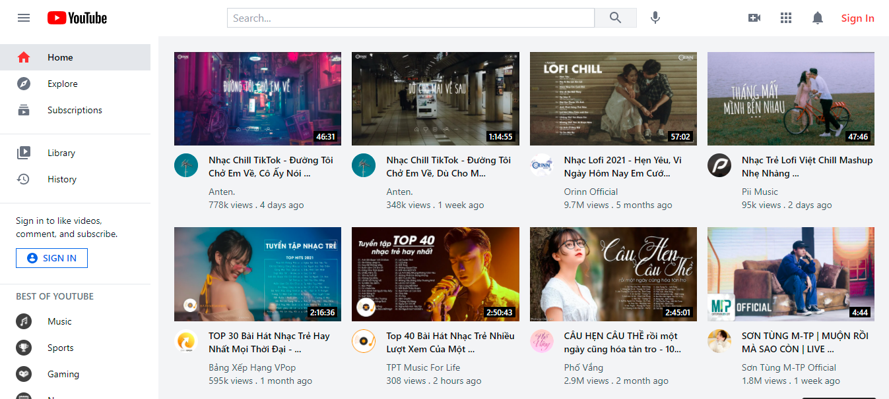

# Learn React and Redux by Building Youtube.

> Click :star: if you like the project. Pull Request are highly appreciated :heart:

I'm Hiep. I work as a full-time software engineer. Most of my open-source projects are focused on one thing - to help people learn 📚. 

The repository helps you learn React, Redux and Tailwind CSS by buiding Youtube.

My post is about __Learn React and Redux By Building Youtube__ on Dev.to: https://dev.to/hieptl/learn-react-redux-and-tailwind-css-by-building-youtube-29ea

Live Demo: https://407mq.csb.app/

> If you feel the repository is useful, please help me share the post and give me a Github :star:. It will make me feel motivation to work even harder. I will try to make many open sources and share to the community.

 You will learn the following Next.js concepts:

- React.
- Redux.
- Redux Thunk.
- Redux Saga
- Firebase.
- useDispatch.
- useSelector.